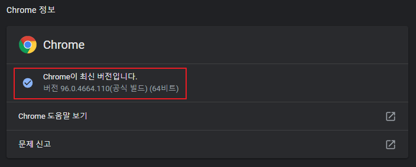

# python-web-crawling
Chrome web crawling using python

## 설치 방법
1. [python](https://www.python.org/) 설치 또는 확인(`python --version`)
2. [크롬 드라이버](https://chromedriver.chromium.org/downloads)를 자신의 크롬 버전과 일치하는 파일 다운로드 후 해당 소스와 같은 위치에 복사  
  
3. `selenium`, `bs4` 파이썬 라이브러리 설치
   ```
   pip install selenium
   pip install bs4
   ```
4. 해당 코드 실행 visual studio code 기준 `F5`


## 사용 방법
1. google_input_crawl: search_path에 폴더 위치 생성 후 코드 실행

    ``` python
    search_name = input("검색하고 싶은 키워드 : ") # 검색 키워드
    search_limit = int(input("원하는 이미지 수집 개수 : "))
    search_path = "./inputCrawling/"
    ```
2. google_multi_crawl: searchList 변수에 저장하고 싶은 명령어 삽입 후 실행

    ``` python
    searchList = ['오징어게임', '오일남'] # 검색 키워드
    ```

크롤링 이미지는 해당 프로젝트 내 폴더에 자동으로 생성됩니다.

